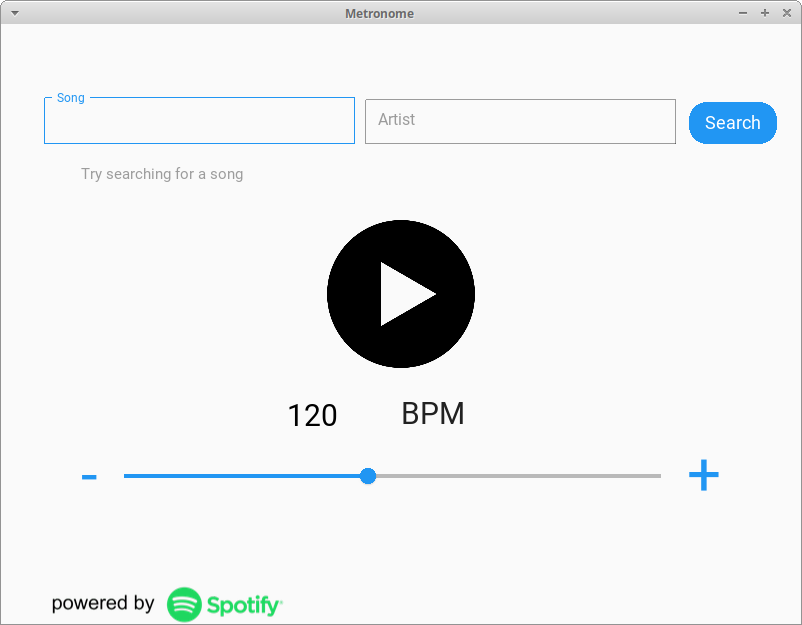
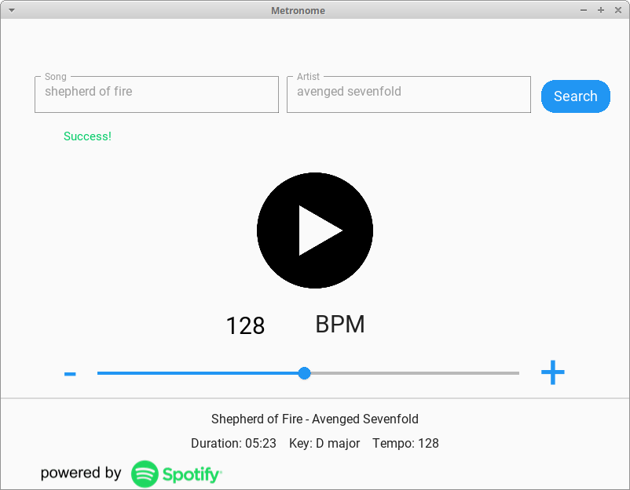

# Metronome

Metronome is a cross-platform kivy and kivymd metronome that lets you search for a song's bpm through the spotify API and immediately play it.

# Motivation

I noticed that sometimes when i hear song, i immediately want find out its bpm and see if i can keep up.

This app provides an easier way to do it that googling the bpm and opening a metronome.

# Name

Naming suggestions are welcome, i honestly have no idea what to call this.
# Screenshots
 

# Installation

TODO

# How to use?

Run metronome/__main__.py or execute the command `python -m metronome`

# Credits

Play and pause icons by Freepik.com
Click sound by mixkit.co
Spotify API and logo by the spotify company.

# License

TODO
