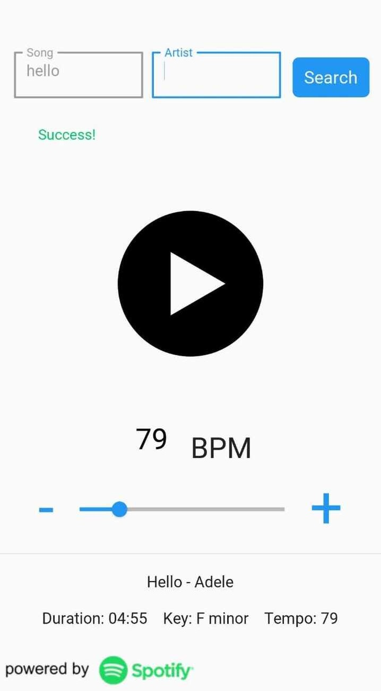

# Metronome

Metronome is a cross-platform kivy and kivymd metronome that lets you search for a song's bpm through the spotify API and immediately play it.

# Name

Naming suggestions are welcome, i honestly have no idea what to call this.

# Screenshots

# Setting up
## Using prebuilt version
Available for windows and android.

For windows, you can find a standalone `.exe` file in platform_specific/windows.

For android, you can find an apk in platform_specific/android

## From source
You need to have spotify client credentials - client id and client secret.

Follow [this guide](https://developer.spotify.com/documentation/general/guides/app-settings/) to get client credentials.

Edit `config.cfg` with your credentials.

Afterwards, follow platform-specific instructions:

### For computer
* Simply install required packages: `pip install -r requirements.txt`

* To use, run main.py from the main project folder.
### For android

If you choose this method, you'll have to build it from source using buildozer.

Be warned that this can be very time-consuming, and that **buildzoer is currently not available for windows**.

*Note: the metronome feature might not function correctly*

#### Instructions:
* *Optional: make a virtual env for building named build*

* install buildozer and dependencies.

* move buildozer.spec from android folder to main folder.

* Run  `buildozer android debug deploy` from terminal in main project directory.

# Credits

Spotify API and logo by [Spotify](spotify.com)

Play and pause icons by [Freepik](Freepik.com)

Click sound by [mixit](mixkit.co)
